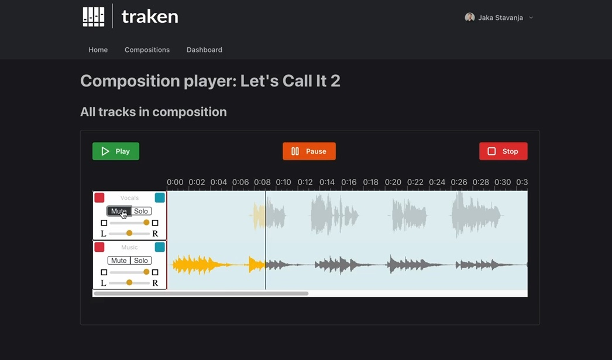

# Traken 🎷

## Take a track and jam along by disabling any instrument!

# Features

- Authentication 🔑
- Creating songs / compositions 🎷
- Adding tracks to compositions (S3 bucket storage with local MinIO dockerfiles) 🎼
- Playing songs / compositions ⏯
- Muting / altering volume / ... of songs in the UI Player 🎹.
- Fullstack typesafety 👷

# Setup instructions for development

To set up your environment for local development, execute the following order of commands:

1. `npm i`
2. populate env as per `.env.example`, taking into consideration the following points:
   - S3 id and secret are the same as `MINIO_` credentials
   - `DATABASE_URL` is the full postgres url with credentials from the docker-compose YAML file (e.g. https://www.prisma.io/docs/guides/development-environment/environment-variables#expanding-variables)
   - without postgres, you can use `DATABASE_URL=file:./db.sqlite` and switch the driver to `sqlite` in `schema.prisma`, but you'll have to comment out all `@db.Text` occurrences in the schema as well.
3. `npx prisma db push`
4. `npm run dev`
5. `cd docker`
6. populate the `MINIO_ROOT_PASSWORD` and `POSTGRES_PASSWORD` fields with your passwords of choice
7. run `docker-compose up -d`
8. log in to the minio console with your credentials
9. create a bucket with the name you entered into the `.env` file

# Bigger TODOs (help welcome)

- fix error: `Warning: A title element received an array with more than 1 element as children`.
  - In browsers title Elements can only have Text Nodes as children.
  - If the children being rendered output more than a single text node in aggregate the browser will display markup and comments as text in the title and hydration will likely fail and fall back to client rendering

Author and maintainer: @jstavanja, 2023.
